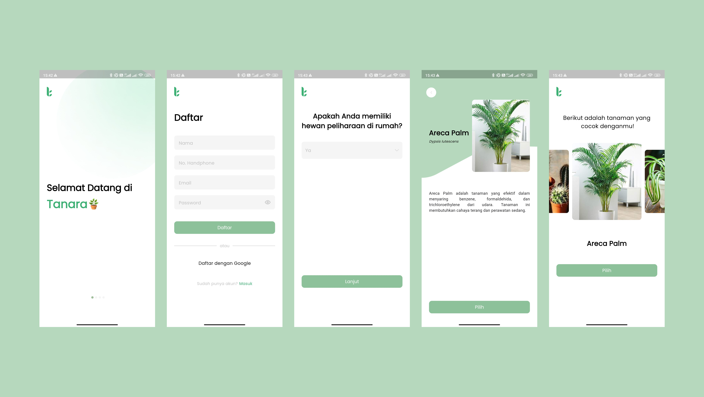

# Tanara App 🌱

Polusi udara sudah menjadi isu yang serius secara global. Polusi udara dapat disebabkan oleh berbagai faktor, misalnya peningkatan emisi gas kendaraan, limbah gas dari kegiatan industri, dan lain-lain. Hal-hal tersebut menyebabkan menurunnya kualitas udara, khususnya di Indonesia sekarang ini. Namun, memburuknya kualitas udara yang semakin signifikan belum diimbangi dengan tindak penanggulangan yang memadai sehingga isu ini masih menjadi topik yang menimbulkan keresahan masyarakat. Oleh karena itu, kami mengajak setiap individu untuk ikut serta dalam menanggulangi masalah penurunan kualitas udara dengan Tanara. Tanara memberikan rekomendasi tanaman yang mudah dirawat, memberikan instruksi cara penanaman dan perawatan yang baik dan benar, serta membantu mendeteksi penyakit pada tanaman. Tanaman yang direkomendasikan adalah tanaman yang terbukti secara ilmiah dapat membantu meningkatkan kualitas udara. Selain itu, Tanara juga menyediakan platform e-commerce bagi customer untuk melakukan pembelian tanaman yang direkomendasikan serta barang-barang lain yang diperlukan untuk perawatan tanaman. Tanara bekerja sama dengan supplier lokal untuk menyediakan supply tanaman dan barang yang diperlukan. Tanara mengajak setiap individu untuk turut andil dalam upaya peningkatan kualitas udara, karena kami percaya semua itu dimulai dari hal kecil ✨

## ✨ Features

- 📐 Register.
- ⏱️ Login.
- 🌱 Recomendation plant.
- 😍 Simple and friendly animations.

## 🖼️ Screenshots 

